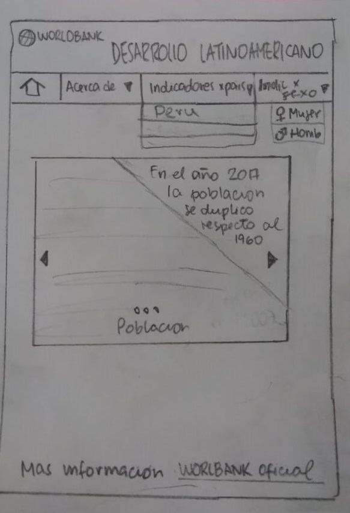
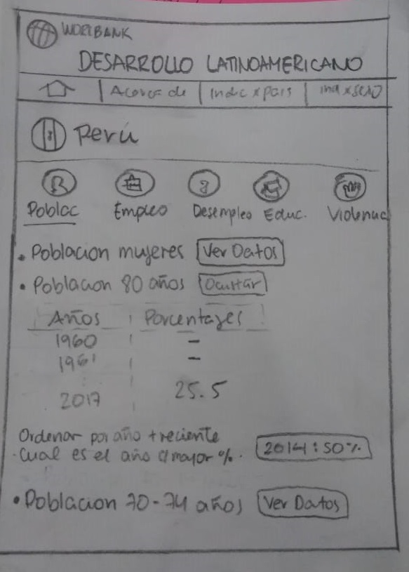
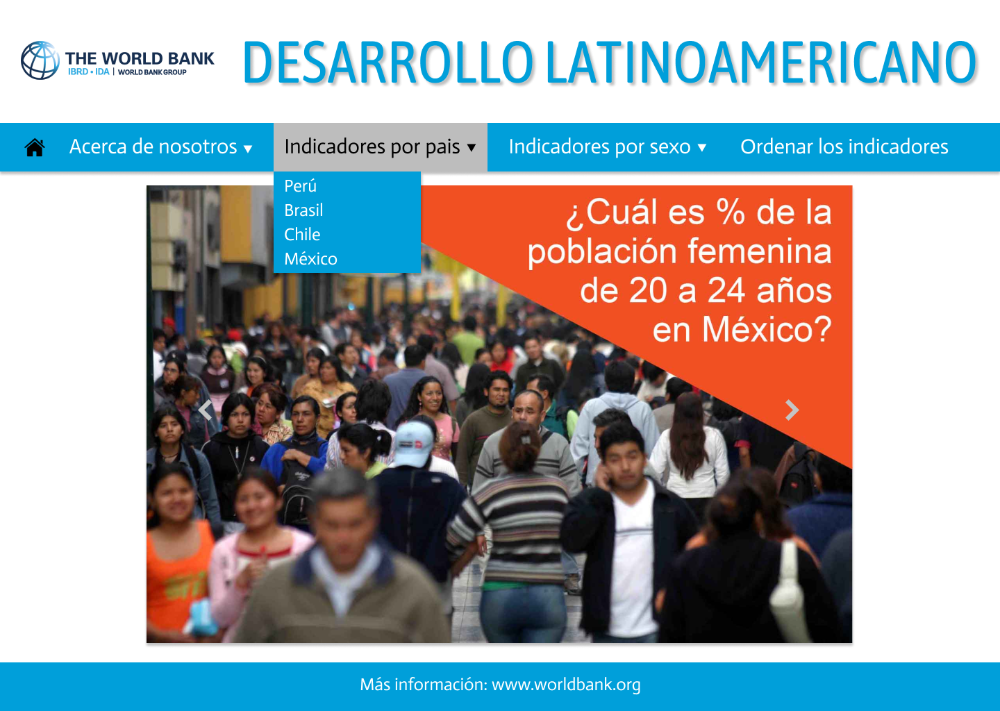
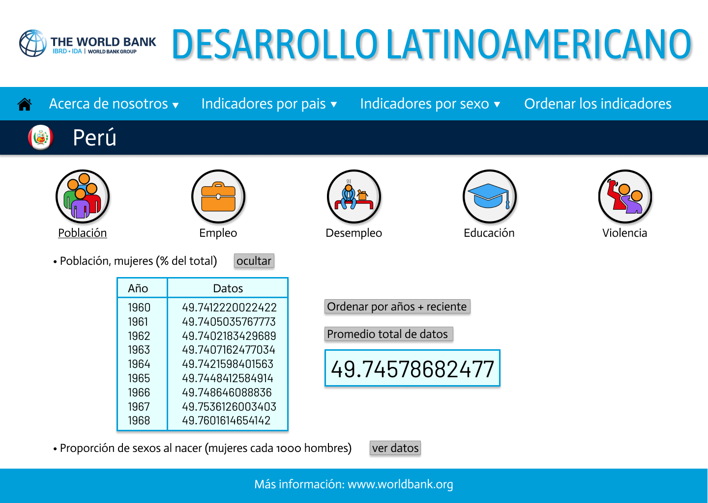

# Desarrollo Latinoamericano - WORLDBANK

## Índice

* [Introducción](#introducción)
* [Historias de usuario](#historias-de-usuario)
* [Prototipos](#prototipos)
* [Descripción del producto](#descripción-del-producto)

***

## Introducción

El banco mundial es una organización multinacional especializada en finanzas y asistencia. Su propósito declarado es reducir la pobreza mediante préstamos de bajo interés, créditos sin intereses a nivel bancario y apoyos económicos a las naciones en desarrollo.

## Historias de usuario

Como historias de usuarios tenemos:
* Como usuario me gustaria poder ver la información por cada país para poder conocer  la diferencia entre de cada país.
* Como usuario me gustaria poder tener un link que me redireccione a la pagina oficial que me pueda brindar mayor información.
* Como usuario me gustaria poder escoger ver la información por sexo entre hombres y mujeres para poder compararla y ver la diferencia de estos datos.
*Como usuario me gustaria ver la información de los años y datos en una tabla para que sea más facil de poder comprender.

## Prototipos

#### Prototipo de baja fidelidad

 
[prototipo-baja-fidelidad-3](src/imagen/prototipo-baja-3.jpeg)

#### Prototipo de alta fidelidad

 
[prototipo-baja-fidelidad-3](src/imagen/prototipo-alta-3.png)

#### Link a Zeplin 

- Se puede mostrar el diseño en este link: (https://zpl.io/awWPk01)

## Descripción del producto

