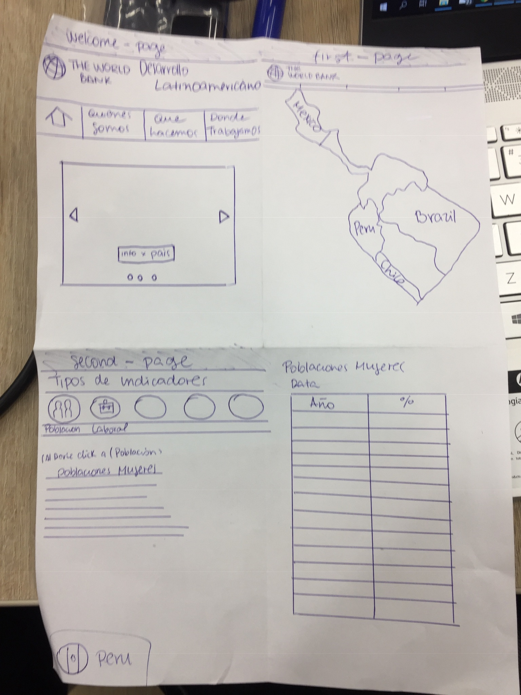
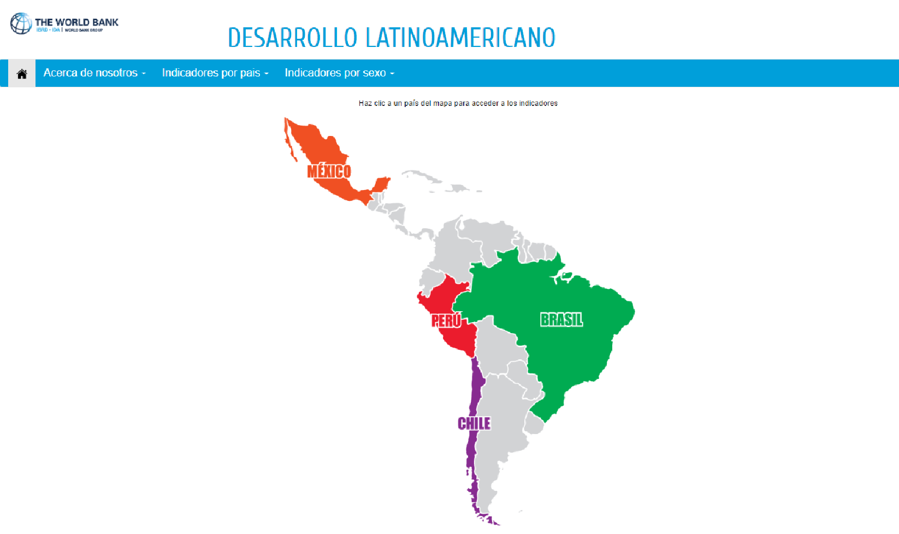
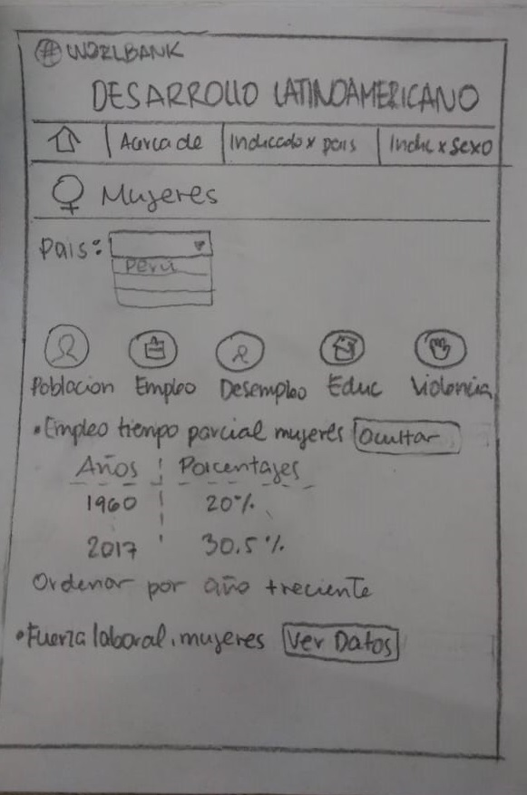
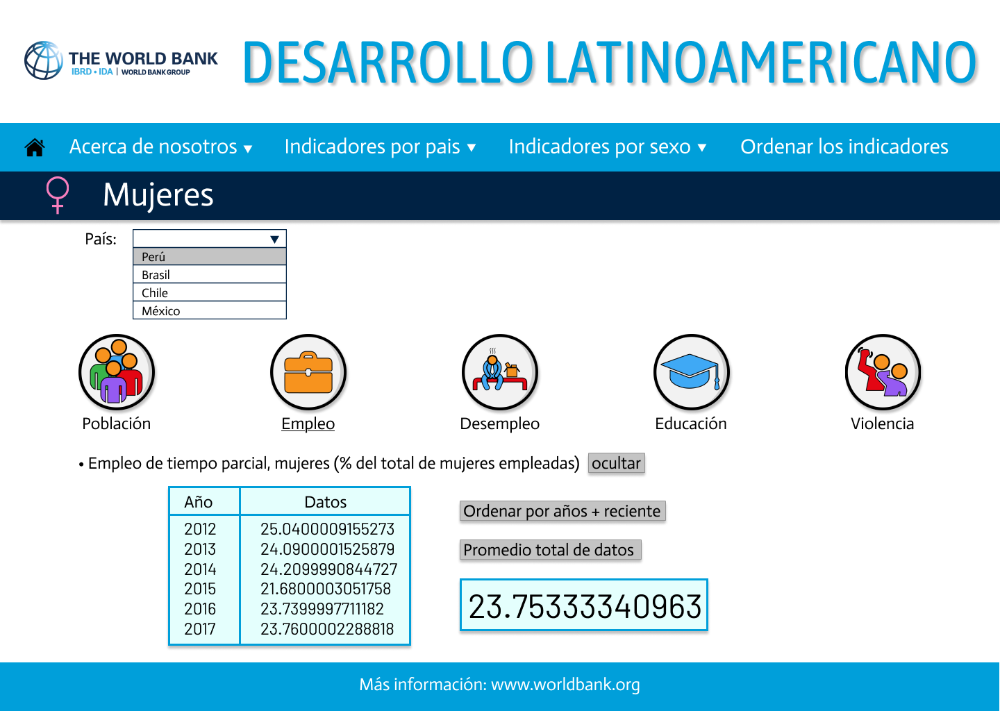

# Desarrollo Latinoamericano - WORLDBANK

## Índice

* [Descripción](#Descripción)
* [Descripción del producto](#Descripción-del-producto)
* [Historias de usuario](#Historias-de-usuario)
* [Testeo de usabilidad](#testeo-de-usabilidad)
* [Prototipos](#Prototipos)

***

## Descripción

Este proyecto contiene información del Banco Mundial acerca de los indicadores de ciertos países de américa latina `Perú` `Brasil` `Chile` `México`, hemos dividido la inforomación según los indicadores más representativos: indicadores de **población,empleo,desempleo,educaci+on,violencia** así también hemos clasificado la data segun el sexo **hombres y mujeres** podremos observar la data desde los años **1960 - 2017** y el promedio de cada indicador.

## Descripción del producto

- **¿Quiénes son los principales usuarios del producto?**

Estudiantes universitarios o de institutos que estén realizado trabajos de investigación como por ejemplo tesina, tesis. También profesionales que trabajan en el rubro de la investigación, empresarios los cuales requieren de la información de los indicadores demográficos y económicos que se muestran en nuestra página.

- **¿Cuáles son los objetivos de estos usuarios en relación con tu producto?**

Que los principales usuarios puedan acceder a los datos del banco mundial de manera rápida, dinámica y comprensible.  

- **¿Cómo crees que el producto que estás creando está resolviendo sus problemas?**

Se identificó la necesidad que tiene los usuarios principales en buscar información de los indicadores demográficos y económicos, pero la información es difícil de encontrar y en las actuales páginas web que brindan la información, los datos se muestran de forma poco dinámica. Esto siendo tedioso para los usuarios. 

- **Proceso de diseño**

Primero se realizó entrevistas a nuestros usuarios principales, preguntando de qué manera se puede diseñar nuestra página web para que sea atractiva, y los ayude cuando realicen su actividad de investigación. 

Los usuarios nos dijeron que para que la página sea atractiva tiene que presentar los datos en tablas,gráficos, que las letras sean compresibles y  facilidad para acceder a los datos. De esta manera se pudo escribir las historias de usuario para realizar la página web. 

## Historias de usuario

Como historias de usuarios tenemos:
* Como usuario me gustaria poder ver la información por cada país para poder conocer  la diferencia entre de cada uno.
* Como usuario me gustaria poder tener un link que me redireccione a la página oficial que me pueda brindar mayor información.
* Como usuario me gustaria poder escoger y ver la información por sexo entre hombres y mujeres para poder compararla y ver la diferencia de estos datos.
* Como usuario me gustaria ver la información de los años y datos en una tabla para que sea más fácil de poder comprender.
* Como usuario me gustaria ver la información dividida entre género para poder ver cual es la realidad de cada país respecto a la diferencia de género.
* Como usuario me gustaria poder ver la información clasificada por género para poder ver como es la diferencia entre hombres y mujeres respecto a nivel de estudios, tipos de empleo, estabilidad económica y violencia y como ha cambiado a través de los años.
* Como usuario me gustaria poder ver el promedio de cada indicador para facilmente poder comparar entre un valor de un país y otro.
* Como usuario me gustaria poder tener un listado con los indicadores para poder ver que información es relevante para mí.

## Testeo de usabilidad

Despues de entrevistar a nuestros usuarios hicimos nuestro bosquejo con la idea inicial que ellos tuvieron, alguno de ellos nos dijeron que creyeron que sería mas dínamico poder seleccionar el país a elección a través de un mapa.

Nuestro primer bosquejo

Sin embargo durante el testeo de usabilidad mucho de ellos no lo encontraron facil y rapido de acceder a la información mas revelante, por ello hicimos un cambio a nuestro diseño, 

Hicimos nuevamente otro bosquejo teniendo como producto final el diseño de la página actual.

## Prototipos

#### Prototipo de baja fidelidad

 
 
 

#### Prototipo de alta fidelidad

 
 
 

#### Link a Zeplin 

- Se puede mostrar el diseño en este link: [Diseño en Zeplin](https://zpl.io/awWPk01)

